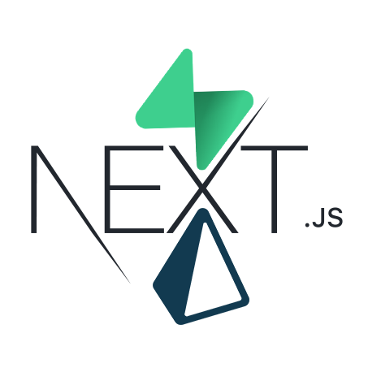

<h1 align="center">Next Supabase Blog</h1>

<p align="center">
	<picture>
		<source srcset="./public/dark-thumb.png" media="(prefers-color-scheme: dark)">
		
	</picture>
</p>

## About this application

This is a fully functional social blog application. The main idea is its functionality, but I tried my best to make it clean and responsive.

<a href="https://next-supabase-blog.vercel.app" target="_blank" title="Next Supabase Blog">Live Demo</a>

## Build Setup

```bash
# install dependencies
$ npm install

# serve with hot reload
$ npm run dev

# build for production and launch server
$ npm run build
$ npm run start

# Make sure you have configured the ".env" file like ".env.example" then migrate with prisma.
# If you have problems with migrations, try to delete prisma/migrations folder and run the command again.
$ npx prisma migrate dev --name <MIGRATION_NAME>

```

### List of the features

- Create accounts, change account informations (location, profession, bio, display name, username, profile picture, cover image).
- Every user has a public profile page which includes a list of the posts that the user has published, a list of the posts that the user hase liked, a cover image of the user and user informations.
- Write posts, delete posts, edit posts (description, content, post image, tags).
- Like posts, add/remove posts to your bookmarks.
- Follow/Unfollow people, list the posts of the ones you have followed (feed).
- List the posts by tags (Max of 5 tag is supported for each post).
- Write comments, up/down vote comments, delete comments, edit comments(content), inspect comments' edit history.
- Mobile friendly as much as I could handle.

<br>

## Reach me

**[twitter/@ilyasbilgihan](https://twitter.com/ilyasbilgihan)**

**[instagram/@ilyasbilgihan](https://instagram.com/ilyasbilgihan)**

**ilyasbilgihan@gmail.com**
